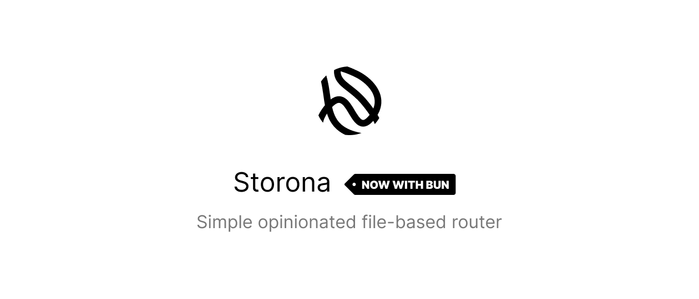

JavaScript backend applications tend to rely on a framework or meta-framework to handle routing and architecture. But for specific use cases in which a full framework is not necessary, developers usually have to build their own routing system from scratch or using a full-fledged wrapper. This is usually a time-consuming process that can be avoided.

For this reason, Storona was created. It is designed to be easy to use and easy to understand, with a minimal learning curve.

Here's a quick example of how to use Storona:

```js
const express = require("express");
const { createRouter } = require("storona");

const app = express();

createRouter(app, {
  directory: "src/routes",
  // Set to true to use the package version. 1.0.0 -> /v1
  prefix: "/v1/api",
  quiet: false,
});

app.listen(3000, async () => {
  console.info("API running on port 3000");
});
```

#### Result

```
.
└─ src
   ├─ routes
   │  ├─ directory
   │  │  ├─ [fruit].get.js   --> GET  /v1/api/directory/:fruit
   │  │  └─ index.put.mjs    --> PUT  /v1/api/directory
   │  ├─ apple.post.ts       --> POST /v1/api/apple
   │  └─ index.get.jsx       --> GET  /v1/api
   └─ index.js
```

## Philosophy

Storona is designed to be simple and easy to use. It is neither a complete framework nor a package for certain framework. The goal is to unify simple architecture to something that everyone can understand and use.

The idea of route design was highly inspired by the [Nitro](https://nitro.unjs.io/guide/routing#filesystem-routing) framework that uses h3 under the hood. Storona on the other hand is compatible with the following frameworks: Express, Fastify.

For the simplicity reason Storona supports TypeScript and JSX out-of-the-box. The transpilation of routes is handled by [tsup](https://tsup.egoist.dev/).

> Use `compilerOptions.jsx` in your `tsconfig.json` to change the transpilation behavior of JSX/TSX.

## Limitations

Due to some [characters being forbidden in Windows file names](https://stackoverflow.com/a/31976060/14301934), Storona may not provide full set of features of the underlying framework's route registration.

To avoid this problem, you can override the route by using the `route` exported variable in the route file. To know more about this, see the [Templates](https://storona.domin.pro/guide/routing/templates#overriding-route-and-method) guide.

## Documentation

For more information regarding Storona, please refer to the [official documentation](https://storona.domin.pro).
