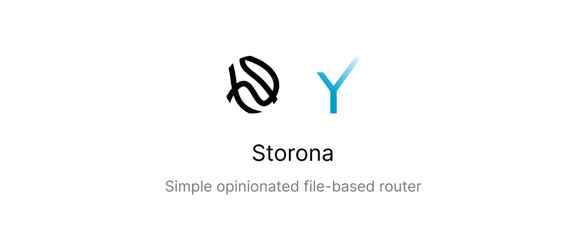

<h1>
  Overview
  <sup>
    <strong>
      <code>&nbsp;<a href="https://storona.domin.lol/adapters/grammy/">Documentation</a>&nbsp;</code>
    </strong>
  </sup>
</h1>

This package is an adapter for [storona](https://storona.domin.lol/) file-based router. It allows to use [grammY](https://grammy.dev/) telegram bot framework with storona.

> Regarding all features and caveats, please refer to the documentation.

# Install

```bash
$ npm install storona grammy @storona/grammy
$ yarn add storona grammy @storona/grammy
$ pnpm add storona grammy @storona/grammy
$ bun add storona grammy @storona/grammy
```

# License

This project is under [MIT](https://choosealicense.com/licenses/mit/) license. You can freely use it for your own purposes.
