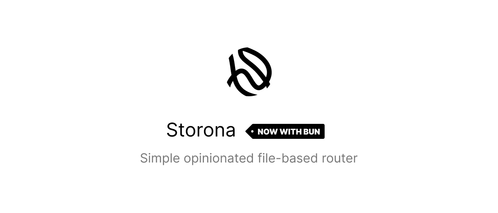

<h1>
  Overview
  <sup>
    <strong>
      <code>&nbsp;<a href="https://storona.domin.lol/">Documentation</a>&nbsp;</code>
    </strong>
  </sup>
</h1>

JavaScript backend applications tend to rely on a framework or meta-framework to handle routing and architecture. But for specific use cases in which a full framework is not necessary, developers usually have to build their own routing system from scratch or using a full-fledged wrapper. This is usually a time-consuming process that can be avoided.

For this reason, Storona was created. It is designed to be easy to use and easy to understand, with a minimal learning curve.

Here's a quick example of how to use Storona:

```ts
import express from "express";
import { createRouter } from "storona";
import { adapter } from "@storona/express";

const app = express();

createRouter(app, {
  directory: "src/routes",
  adapter: adapter(),
});

app.listen(3000, () => {
  console.info("API running on port 3000");
});
```

### Result

```
.
└─ src
   ├─ routes
   │  ├─ directory
   │  │  ├─ [fruit].get.js   --> GET  /v1/api/directory/:fruit
   │  │  └─ index.put.mjs    --> PUT  /v1/api/directory
   │  ├─ apple.post.ts       --> POST /v1/api/apple
   │  └─ index.get.jsx       --> GET  /v1/api
   └─ index.ts
```

## Philosophy

Storona is designed to be simple and easy to use. It is neither a complete framework nor a package for certain framework. The goal is to unify simple architecture to something that everyone can understand and use.

The idea of route design was highly inspired by the [Nitro](https://nitro.unjs.io/guide/routing#filesystem-routing) framework that uses h3 under the hood. Storona on the other hand is compatible with different kind of frameworks like [Express](https://expressjs.com/), [Fastify](https://fastify.dev/) and [grammY](https://grammy.dev/).

For the simplicity reason Storona supports TypeScript and JSX out-of-the-box. The transpilation of routes is handled by [tsup](https://tsup.egoist.dev/). For more information regarding the configuration, see the [Transpilation of TypeScript](https://storona.domin.lol/learning/transpilation-of-typescript) guide.

## Documentation

For more information regarding Storona, please refer to the [official documentation](https://storona.domin.lol).
